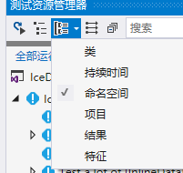
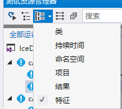
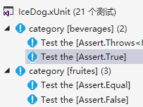

# xUnit

> github:https://github.com/xunit/xunit
>
> github.io and docs:https://xunit.github.io/

目前在.Net框架下的测试工具主要有Nunit、内置的MSTest以及Xunit这三个工具，这里介绍一下如何在VS中使用XUnit这个测试框架的后起之秀。

xUnit是一个测试框架，现在已经集成到visual studio，可以在visual studio中使用。

主要是针对.net core 应用，当然 .net framework也可以使用，通过nuget下载包即可。

## 教程

> 使用Xunit进行单元测试 http://www.51testing.com/html/89/n-3720289.html
>
> https://blog.csdn.net/xl_lx/article/details/80613455

按照教程使用即可，还是很简单的，其余参考项目 IceDog.xUnit

唯一需要注意的是visual studio 测试资源管理器的分组的使用



### Trait特性

用于根据特征分类

如下编写

```c#
[Trait("category", "beverages")]
[Fact]
public void True(){}
```

然后选择特征（如果选不了，呈现灰色，则把左边的按钮取消选中即可选择了）。



效果如下




